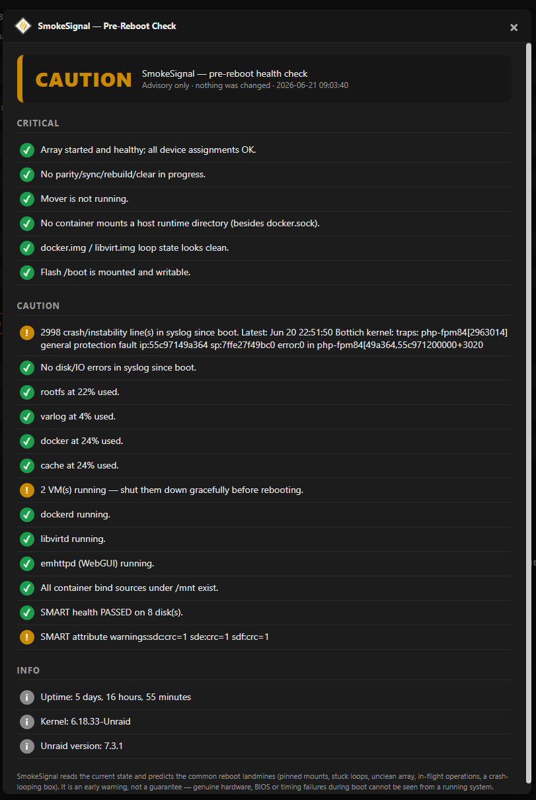
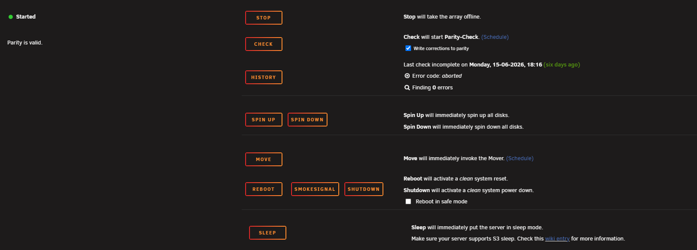

<p align="center">
  <picture>
    <source media="(prefers-color-scheme: dark)" srcset="https://raw.githubusercontent.com/junkerderprovinz/smokesignal/main/.github/assets/banner-dark.png">
    
  </picture>
</p>

<p align="center">
  <a href="https://github.com/junkerderprovinz/smokesignal/actions/workflows/release.yml"></a>&nbsp;
  <a href="https://github.com/junkerderprovinz/smokesignal/actions/workflows/lint.yml"></a>&nbsp;
  <a href="https://unraid.net"></a>&nbsp;
  <a href="https://github.com/junkerderprovinz/smokesignal/releases"></a>&nbsp;
  <a href="LICENSE"></a>
</p>

<p align="center">
An Unraid plugin that answers one question before you reboot: <b>will the box come back up clean?</b><br>
SmokeSignal reads the live host state and gives you a single verdict — <b>GO / CAUTION / NO-GO</b> — with the exact findings, so you never reboot into a known landmine. Advisory only: it reads, it never touches anything.
</p>

<p align="center">
  <a href="https://buymeacoffee.com/junkerderprovinz">
    
  </a>
</p>

<br>

## Table of Contents

1. [What is this?](#1-what-is-this)
2. [Screenshots](#2-screenshots)
3. [What it checks](#3-what-it-checks)
4. [How it works](#4-how-it-works)
5. [Install](#5-install)
6. [Development](#6-development)
7. [Support this project](#7-support-this-project)

<br>

## 1. What is this?

A reboot is never 100% guaranteed, but a large class of "it didn't come back right" is **predictable from the current live state**. SmokeSignal inspects that state before you reboot and gives you a single, honest verdict:

- **GO** — nothing found that should block a reboot
- **CAUTION** — non-fatal issues you should know about first
- **NO-GO** — conditions likely to make the reboot come back dirty

It is **advisory only**. It reads the system and reports. It never stops, mounts, unmounts, or changes anything — because acting on the host is exactly what tends to cause reboot trouble in the first place.

The plugin adds a **SmokeSignal** button next to *Reboot* on the **Main** tab, plus a **Tools → SmokeSignal** page with a short description. Click it and a **live progress bar** shows each check as it runs; then read the verdict and reboot with confidence. Each problem finding is a **click-through link** straight to the page where you fix it — syslog and disk/IO findings open the System Log viewer, array/parity/SMART/space findings open Main, running VMs open the VMs tab, and so on. The report follows your Unraid light/dark theme and **the language configured in the Unraid UI** (all 26 supported languages, English fallback).

<br>

## 2. Screenshots

<p align="center">
  
  <br><em>The pre-reboot report: a single GO / CAUTION / NO-GO verdict with the exact checks behind it. Advisory only — it never changes anything.</em>
</p>

<br>

<p align="center">
  
  <br><em>One click from the Main tab — the SmokeSignal button sits right next to Reboot.</em>
</p>

<br>

## 3. What it checks

**Critical — a failure here means NO-GO**

- Array started and clean (no disabled / invalid / missing disks)
- No parity check / sync / rebuild / clear in progress, mover not running
- No container mounting a host runtime directory (`/var/run`, `/run`, `/var/run/libvirt`, … — `docker.sock` excepted) — the bind class that can take libvirt/docker down on reboot
- No stuck `docker.img` / `libvirt.img` loop (attached-but-not-mounted, or a loop backing a deleted file)
- Flash `/boot` mounted and writable

**Caution — worth knowing before you reboot**

- Crashes since last boot in the syslog (segfault, general-protection-fault, OOM, kernel panic, call traces)
- Low free space on `/`, `/var/log` (both RAM), `docker.img`, cache
- VMs currently running (a reboot force-stops them)
- A core service down right now (dockerd / libvirtd / emhttpd)
- Container bind sources under `/mnt` that no longer exist
- SMART health (`smartctl -H`) on every disk

**Info** — uptime, kernel, Unraid version.

### Honest limits

This is an early-warning check, not an oracle. Genuine hardware, BIOS or timing failures during boot cannot be seen from a running system. What it *does* cover reliably is the state-detectable class: pinned mounts, stuck loops, an unclean array, in-flight array operations, a low-on-RAM or crash-looping box.

<br>

## 4. How it works

A single Bash engine (`smokesignal-check.sh`) runs the checks by querying the tools Unraid already ships — `mdcmd`, `losetup`, `docker`, `smartctl`, `df`, `pgrep`. No daemon, no dependencies. It prints a human-readable report on a console, or machine-readable JSON for the WebGUI:

```bash
smokesignal-check.sh          # human-readable report
smokesignal-check.sh --json   # machine-readable (used by the WebGUI)
```

Exit code mirrors the verdict: `0` = GO, `1` = CAUTION, `2` = NO-GO.

The WebGUI layer is a small PHP page (`SmokeSignalReport.php`) that runs the engine and renders the verdict in an Unraid modal.

<br>

## 5. Install

**Community Apps** *(planned)* — search for **SmokeSignal** in the Apps tab.

**By URL (today):** Unraid → **Plugins** → **Install Plugin**, paste:

```
https://raw.githubusercontent.com/junkerderprovinz/smokesignal/main/plugin/smokesignal.plg
```

<br>

## 6. Development

The plugin files live under [`src/`](src/) mirroring the on-disk layout
(`/usr/local/emhttp/plugins/smokesignal/`). The release `.txz` is built by CI on
a tagged push (`v*`) — built on Linux so executable bits are preserved.

Assets (icon, banner) are generated with
[`.github/assets/render-assets.mjs`](.github/assets/render-assets.mjs).

<br>

## 7. Support this project

If SmokeSignal saved you a bad reboot, you can
[buy me a coffee](https://buymeacoffee.com/junkerderprovinz). Thanks!

---

<sub>Part of a family of self-hosted Unraid apps + plugins by <b>junkerderprovinz</b> — see them all at <a href="https://github.com/junkerderprovinz">github.com/junkerderprovinz</a>, or install from <a href="https://unraid.net/community/apps">Community Applications</a>.</sub>
